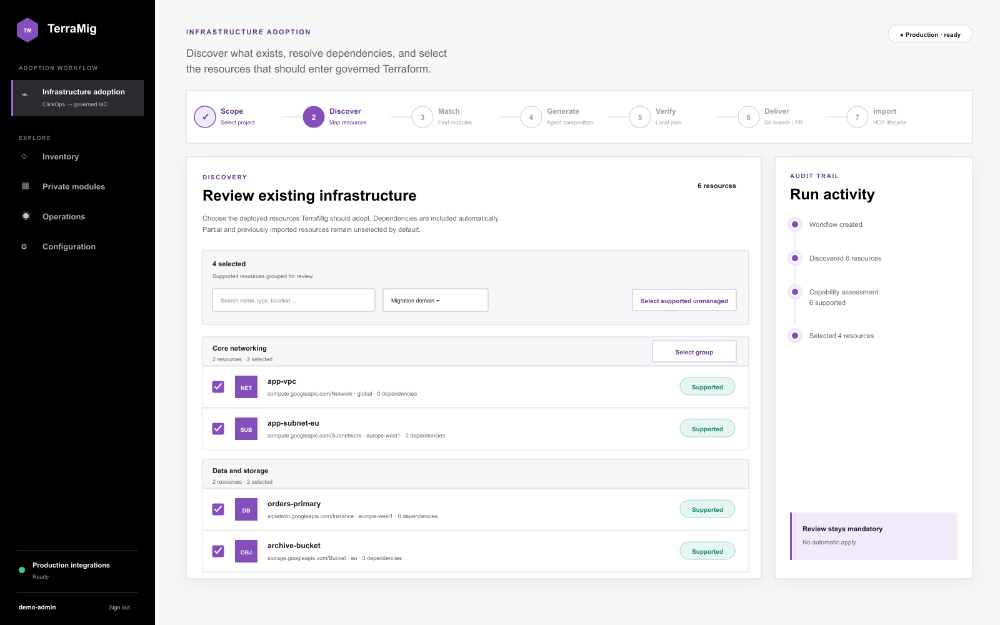
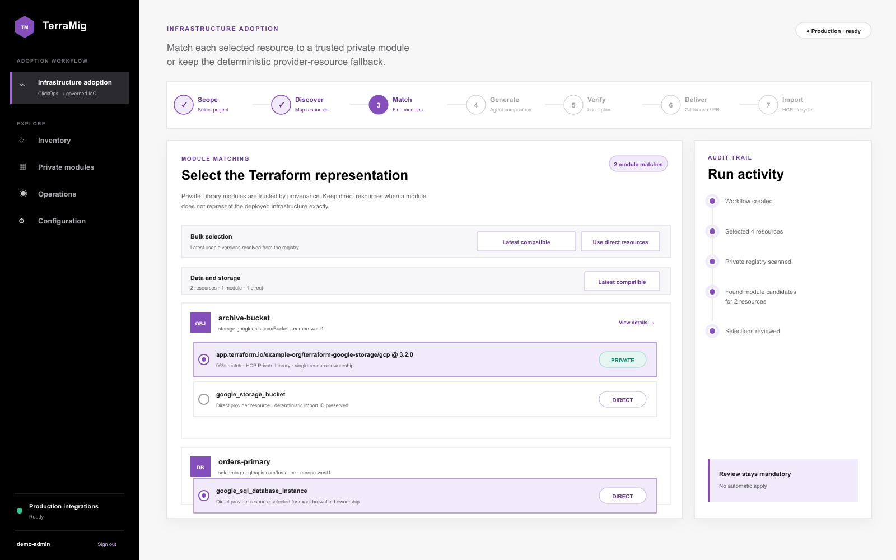
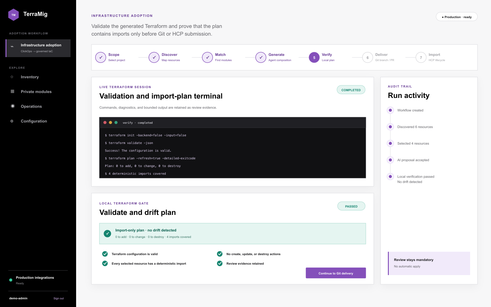

<p align="center">
  
</p>

# TerraMig

<p align="center">
  <strong>Move existing Google Cloud infrastructure into governed Terraform.</strong><br>
  Discover what is deployed, choose the right module or provider resource, verify the plan, and deliver it safely to HCP Terraform.
</p>

<p align="center">
  <a href="https://github.com/fphilippon/TerraMig/actions/workflows/ci.yml"></a>
  <a href="https://github.com/fphilippon/TerraMig/actions/workflows/codeql.yml"></a>
  <a href="LICENSE"></a>
</p>

<p align="center">
  <a href="#quick-start">Run locally</a> ·
  <a href="#the-infrastructure-adoption-workflow">See the workflow</a> ·
  <a href="#production-integrations">Configure production integrations</a> ·
  <a href="#safety-model-at-a-glance">Review the safety model</a>
</p>

> [!IMPORTANT]
> TerraMig is an adoption and review control plane. It does not create or change GCP resources during discovery, matching, generation, or local verification, and it never auto-applies the final HCP Terraform plan.

## See the workflow at a glance

A guided view of the seven-stage infrastructure-adoption workflow:

<table>
  <tr>
    <td width="33%"><strong>1–2 · Discover</strong><br></td>
    <td width="33%"><strong>3 · Match</strong><br></td>
    <td width="33%"><strong>5 · Verify</strong><br></td>
  </tr>
</table>

The workflow connects deterministic discovery, operator-controlled representation
choices, AI-assisted composition, local Terraform verification, Git delivery,
and a protected HCP Terraform import.

### The 60-second mental model

| Stage | TerraMig does | You decide |
| --- | --- | --- |
| **Discover** | Reads Cloud Asset Inventory and resolves dependencies | Which deployed resources belong in this adoption |
| **Match** | Finds the latest compatible private or public module | Module, direct provider resource, or exclusion |
| **Generate** | Uses Bob or Copilot for bounded Terraform composition | Whether the proposal is acceptable |
| **Verify** | Runs `terraform validate` and an import-only local plan | Whether a documented drift exception is acceptable |
| **Deliver** | Writes stable Terraform files to a Git branch and optional PR | What enters the target repository |
| **Import** | Protects the HCP workspace and queues a saved plan | When to review and manually apply in HCP Terraform |

TerraMig helps teams bring existing Google Cloud infrastructure under Terraform
management. It discovers resources that were created manually or by another tool,
finds how they depend on each other, generates reviewable Terraform, delivers it
through Git, and prepares a safe import into HCP Terraform.

TerraMig prefers approved modules from the HCP Terraform Private Registry. When
no compatible module exists, it can use the corresponding Google provider
resource directly.

## What problem does TerraMig solve?

An existing GCP project may contain networks, virtual machines, databases,
storage, GKE clusters, service accounts, and many other resources that are not
represented in Terraform.

Writing Terraform for those resources by hand is difficult because the operator
must:

- find every relevant resource;
- understand its dependencies;
- reproduce its current configuration without changing it;
- choose the right private Terraform modules;
- calculate the correct Terraform import addresses and remote IDs;
- prove that the import will not create, update, or delete infrastructure; and
- move the reviewed code and state into the correct HCP Terraform workspace.

TerraMig coordinates those tasks in one guided workflow. AI performs the
configuration-heavy work, while deterministic checks retain control over
resource identity, module ownership, import IDs, safety, and approval.

## What TerraMig does not do

TerraMig does not:

- create or modify GCP resources during discovery, matching, generation, or
  local verification;
- let the AI choose arbitrary modules, import IDs, or shell commands;
- silently import unsupported or incomplete resources;
- automatically apply the final HCP Terraform plan; or
- bypass Git review or workspace protection.

The final import happens only when an operator reviews and explicitly applies
the saved plan in HCP Terraform.

## The infrastructure-adoption workflow

The UI divides adoption into seven clear stages:

### 1. Scope

Choose the GCP project to inspect and confirm the destination HCP Terraform
organization and workspace. No GCP resource is changed.

### 2. Discover

TerraMig reads Google Cloud Asset Inventory, keeps resources that represent
deployed infrastructure, and builds their dependency graph.

Each resource is classified as:

- **Supported** — configuration and import identity are complete;
- **Partial** — the resource is known, but the available data is not safe enough
  for automatic composition;
- **Unsupported** — the resource should not or cannot be imported independently;
  or
- **Unknown** — TerraMig has no verified mapping for that asset type.

Only supported resources are selected by default. Selecting a resource also
includes its supported dependencies.

### 3. Match

For each selected resource, TerraMig searches compatible modules in the HCP
Terraform Private Registry. The operator can also search verified modules in
the public Terraform Registry.

The operator chooses the Terraform representation:

- an approved module; or
- the verified `google_*` provider resource as a direct fallback.

TerraMig pins the chosen module version and verifies which managed resource
address owns the imported object.

### 4. Generate

GitHub Copilot or IBM Bob receives a bounded, redacted description of the
selected resources, their dependencies, and the authorized module choices.

The agent composes the infrastructure configuration in `main.tf`. TerraMig
separately generates:

- `providers.tf`, with the pinned Google provider and project;
- `backend.tf`, with the configured HCP Terraform organization and workspace;
- `imports.tf`, with deterministic declarative import blocks; and
- provenance and assurance evidence.

The AI proposes Terraform addresses, but TerraMig reconstructs the remote import
IDs and commands from the reviewed inventory.

### 5. Verify

TerraMig runs the generated bundle in an isolated temporary directory:

```text
terraform init -backend=false
terraform validate
terraform plan
terraform show
```

The plan must contain exactly the expected imports and no create, update, or
delete action. A safe configuration therefore produces an **import-only,
zero-drift plan**.

When Terraform validation succeeds and the plan still contains every expected
import, an operator can explicitly accept reported create, update, or destroy
actions from the Verify screen. TerraMig records that exception and carries a
warning into final approval. The override cannot bypass initialization,
validation, planning, plan inspection, or incomplete import coverage, and the
resulting HCP saved plan still requires manual review and apply.

For configuration-only errors, TerraMig can give sanitized Terraform
diagnostics back to the selected AI agent for up to two bounded repair attempts.
Credentials, permissions, quota, billing, connectivity, and missing resources
remain operator errors and are never delegated to the agent.

### 6. Deliver

TerraMig copies non-conflicting files from an optional model repository, writes
the verified Terraform bundle into the target application repository, commits
it on a dedicated branch, pushes the branch, and can open a GitHub pull request.

For a new destination, TerraMig writes the consolidated `main.tf` and
`imports.tf` bundle. For an existing Terraform directory, the operator can
select the additive update layout: TerraMig writes stable per-resource files
such as `google_storage_bucket_archive.tf`, colocates each declarative import
with its resource or module, and preserves unrelated configuration plus
existing backend and provider files. Filename collisions still fail closed
unless the operator explicitly authorizes replacement.

### 7. Import

TerraMig protects the HCP Terraform target before submitting anything. The
workspace must be empty, unlocked, configured for remote or agent execution,
have auto-apply disabled, and have no active run. API-driven and VCS-driven
workspaces are supported.

TerraMig uploads the same reviewed configuration and creates a provisional
saved plan. It displays the HCP workspace and run URLs, but never applies the
plan.

After an operator applies the plan in HCP Terraform, TerraMig checks the managed
resource count and queues a final plan-only run. The workflow completes only
when that post-import plan confirms zero drift.

## Example service coverage

Coverage means more than recognizing a service: TerraMig must be able to obtain
configuration-rich inventory, map the object to a pinned Google provider
resource, derive its import ID, and pass the import-only plan.

| GCP service | What TerraMig currently targets | Important boundary |
| --- | --- | --- |
| **GKE** | `google_container_cluster` and `google_container_node_pool` | GKE-managed Compute instances and other generated children are not imported independently. Direct resources are usually safer than a module that also creates unrelated objects. |
| **Cloud SQL** | `google_sql_database_instance` | The database instance is covered. Databases, users, grants, certificates, and backup runs are not yet a complete adoption unit. |
| **Filestore** | `google_filestore_instance`, `google_filestore_backup`, and `google_filestore_snapshot` | Network and file-share configuration must match the deployed instance exactly. |
| **AlloyDB** | Clusters, instances, and backups | Private Service Access and network dependencies must be included. |
| **Compute and storage** | Networks, subnetworks, instances, disks, snapshots, buckets, and many supporting resources | Provider-managed resources and ambiguous regional/global types fail closed. |

The versioned capability catalog contains more than 100 GCP asset-type
mappings. A resource that is not covered remains visible for review but cannot
enter AI composition until a safe mapping is added.

## Safety model at a glance

TerraMig uses several independent gates:

1. read-only GCP discovery;
2. versioned asset-to-provider capability mappings;
3. operator-controlled resource and module selection;
4. constrained AI input and output;
5. host-owned provider, backend, import IDs, and commands;
6. local Terraform validation and an import-only plan;
7. Git delivery and review;
8. HCP workspace protection;
9. explicit human apply in HCP Terraform; and
10. a post-import no-drift plan.

If any gate fails, the workflow stops and retains its logs and evidence.

## Before you start

You need:

- a GCP project and read-only credentials with Cloud Asset Inventory access;
- the Cloud Asset Inventory and Cloud Resource Manager APIs enabled;
- an empty HCP Terraform workspace with auto-apply disabled, using either
  API-driven or VCS-driven configuration;
- an HCP Terraform token that can read the Private Registry and queue plans;
- either IBM Bob or GitHub Copilot configured for AI composition;
- a model repository if the organization uses a standard Git template;
- a target Git repository plus an SSH key or GitHub token; and
- PostgreSQL for durable production execution.

All integrations can be saved and tested from **Configuration** in the UI.
Readiness checks block the related workflow phase when a prerequisite is
missing.

## Quick start

The recommended local deployment starts TerraMig and PostgreSQL together:

```bash
cp .env.example .env
docker compose up --build
```

Open <http://127.0.0.1:8080> and sign in with `admin` / `admin`. The bootstrap account is
local-only and must change its password before any adoption API is unlocked.

For lightweight development without durable state:

```bash
python3 -m pip install -r requirements.txt
PYTHONPATH=src python3 -m terramig.server
```

Without `TERRAMIG_DATABASE_URL` or `TERRAMIG_DATABASE_HOST`, TerraMig deliberately reports `Memory · development` in the
UI. Set `TERRAMIG_REQUIRE_POSTGRES=true` in deployed environments to fail startup unless
PostgreSQL is configured. Run tests with:

```bash
PYTHONPATH=src python3 -m unittest discover -s tests -v
```

## Container details

The multi-stage image includes the Google Cloud CLI, GitHub Copilot CLI, IBM Bob Shell, Terraform, and the official Terraform MCP server. The Terraform download is checked against HashiCorp's SHA-256 manifest; the pinned Bob package is also checksum-verified. Build caches remain outside the final unprivileged runtime image.

Build and run the image. A standalone image uses non-durable development storage unless a
PostgreSQL URL is supplied:

```bash
docker build -t terramig:local .
docker run --rm -p 8080:8080 \
  -v terramig-settings:/app/.terramig \
  terramig:local
```

Open <http://127.0.0.1:8080>. The container runs as an unprivileged user. Use `compose.yaml`
for durable settings, workflows, queued jobs, audit history, users, and sessions.

## Local authentication

TerraMig uses only its own local user database; SAML and SSO are not involved. On an empty
database it creates the requested bootstrap account:

```text
username: admin
password: admin
```

The bootstrap password is PBKDF2-HMAC-SHA256 hashed before storage and is never persisted in
clear text. Its first session is restricted to password change. Replacement passwords require
at least 12 characters and three character classes. Five failed attempts lock the account for
five minutes.

Sessions are opaque random tokens stored only as SHA-256 digests in PostgreSQL. Browser cookies
are `HttpOnly` and `SameSite=Strict`; state-changing requests also require a session-bound CSRF
token. Set `TERRAMIG_SECURE_COOKIES=true` whenever TLS terminates at TerraMig or its trusted
reverse proxy. Override the initial account only on a new database with
`TERRAMIG_ADMIN_USERNAME` and `TERRAMIG_ADMIN_PASSWORD`.

Changing those environment variables does not reset an existing administrator password.

The tool versions are pinned by default and can be overridden explicitly:

```bash
docker build \
  --build-arg COPILOT_VERSION=1.0.71 \
  --build-arg BOB_VERSION=1.0.6 \
  --build-arg TERRAFORM_VERSION=1.15.8 \
  --build-arg TERRAFORM_MCP_IMAGE=hashicorp/terraform-mcp-server:1.1.0@sha256:312d63756b5474df384b1844af55b58ca48cbe0996871e1d6c4239bfcd6fcd29 \
  -t terramig:local .
```

Pass secrets at runtime rather than baking them into the image. Copilot accepts `COPILOT_GITHUB_TOKEN`; Bob accepts `BOBSHELL_API_KEY`; and gcloud can use a read-only mounted Application Default Credentials file through `GOOGLE_APPLICATION_CREDENTIALS`:

```bash
docker run --rm -p 8080:8080 \
  -v terramig-settings:/app/.terramig \
  -v /secure/path/gcp-adc.json:/run/secrets/gcp-adc.json:ro \
  -e GOOGLE_APPLICATION_CREDENTIALS=/run/secrets/gcp-adc.json \
  -e TERRAMIG_GITHUB_TOKEN \
  -e TERRAMIG_HCP_TOKEN \
  -e COPILOT_GITHUB_TOKEN \
  -e BOBSHELL_API_KEY \
  terramig:local
```

Only set the token for the AI provider selected in Configuration. IBM Bob automatically uses API-key authentication when `BOBSHELL_API_KEY` is present.

The Configuration UI can also save, replace, clear, and test the selected AI
credential. UI-managed values are encrypted with Fernet before PostgreSQL
storage, are never returned by the API, and are injected only into the selected
agent process. TerraMig creates a mode-`0600` key at
`/app/.terramig/secret.key` in the persistent runtime volume when
`TERRAMIG_SECRET_ENCRYPTION_KEY` is not supplied. Production deployments should
provide that variable through their secret manager and back it up separately
from PostgreSQL. Losing or rotating the key without re-encrypting stored values
makes existing credentials unreadable.

The **Test connection** control makes one minimal, non-interactive agent request
and records only its verification timestamp. It never persists provider output
or the credential itself in audit data.

The HCP Terraform token has the same masked lifecycle in Configuration. A
UI-managed token is encrypted in the same durable secret store and supplied
only to the private registry, Terraform MCP context, local Terraform
verification, and protected HCP submission clients. Its
**Test connection** control performs a read-only
`GET /api/v2/account/details` request and real migration readiness remains
blocked until that check succeeds. `TERRAMIG_HCP_TOKEN` remains supported for
deployment-managed secrets; environment-provided tokens can be tested but must
be removed through the deployment environment rather than the UI.

## Production integrations

Use **Configuration** in the UI to set the HCP Terraform hostname, organization, workspace,
GCP project, credentials, and protected-submission policy. There is no simulated runtime mode:
missing or unverified integrations block the affected workflow phase.

Infrastructure adoption is read-only until its separately gated HCP saved-plan submission. Credentials can be saved and tested in Configuration; deployment-managed alternatives remain available:

```bash
export TERRAMIG_HCP_TOKEN="..."
gcloud auth login
copilot login  # alternative to saving a Copilot token in Configuration
# or export BOBSHELL_API_KEY="..." when IBM Bob is selected
PYTHONPATH=src python3 -m terramig.server
```

Choose **GitHub Copilot** or **IBM Bob** from Configuration. TerraMig detects the corresponding executable and launches it in non-interactive mode as a child process for generation. Before that launch, TerraMig starts the official Terraform MCP server over stdio with `TFE_ADDRESS` and `TFE_TOKEN`, enables only `search_private_modules` and `get_private_module_details`, and forces `ENABLE_TF_OPERATIONS=false`. Live private-module documentation is added to the bounded generation prompt. The returned JSON must use an approved private source, cannot introduce an unapproved private source, and is validated before use.

For large projects, TerraMig retains the complete selected inventory and
partitions it into dependency-ordered AI batches. Each batch receives resolved
Terraform addresses for dependencies composed earlier, uses a unique address
namespace, and passes the same deterministic assurance checks before TerraMig
merges and validates the complete bundle. This avoids operating-system argument
limits and model context overflows without silently dropping resources. The
defaults are 20 resources and 120 KB of task context per batch; deployments can
adjust `TERRAMIG_AI_BATCH_SIZE` and
`TERRAMIG_AI_MAX_BATCH_PROMPT_BYTES`. TerraMig asks Bob to expose only its
attempt-completion result, retains heartbeat and diagnostic output in the live
terminal, and retries a failed batch process once without discarding batches
already accepted. `TERRAMIG_AI_BATCH_PROCESS_ATTEMPTS` adjusts that bounded
process retry count. If an agent still omits, duplicates, or ambiguously maps a
resource, TerraMig adaptively subdivides only that affected batch into smaller
dependency-aware units with unique address namespaces. Previously accepted
batches remain intact, and the complete merged bundle must still pass the same
deterministic assurance checks.

Configuration accepts a GCP project ID plus Application Default
Credential JSON for service accounts, authorized users, or Workload Identity
Federation external accounts. UI-managed JSON is encrypted in PostgreSQL and
is materialized as a mode-`0600` temporary file only while `gcloud` runs.
`TERRAMIG_GCP_CREDENTIALS_JSON`, `GOOGLE_APPLICATION_CREDENTIALS`, and existing
runtime `gcloud` authentication remain available for deployment-managed access.
**Test GCP connection** performs read-only checks for access to the configured
project and Cloud Asset Inventory resource visibility. Changing the project or
credential clears the previous verification, and infrastructure adoption
remains blocked until the new identity passes the test.

### GCP discovery prerequisites

Discovery depends on two Google APIs being enabled in every project
TerraMig will inspect:

- [**Cloud Asset Inventory API**](https://console.developers.google.com/apis/api/cloudasset.googleapis.com/overview)
  (`cloudasset.googleapis.com`) supplies both the configuration-rich resource
  inventory and the broader resource search.
- [**Cloud Resource Manager API**](https://console.developers.google.com/apis/api/cloudresourcemanager.googleapis.com/overview)
  (`cloudresourcemanager.googleapis.com`) lets TerraMig verify the project and,
  when no fixed project is configured, list the projects visible to the identity.

Before selecting **Enable**, confirm the intended project in the Google console
project selector. To open each page with the project preselected, replace
`YOUR_PROJECT_ID` with the exact project ID, not its display name or number:

```text
https://console.developers.google.com/apis/api/cloudasset.googleapis.com/overview?project=YOUR_PROJECT_ID
https://console.developers.google.com/apis/api/cloudresourcemanager.googleapis.com/overview?project=YOUR_PROJECT_ID
```

The same setup can be performed with the CLI:

```bash
export PROJECT_ID="your-project-id"
gcloud services enable \
  cloudasset.googleapis.com \
  cloudresourcemanager.googleapis.com \
  --project="$PROJECT_ID"
```

The identity uploaded to TerraMig must be able to read the project and its asset
inventory. At minimum, its effective IAM permissions must include
`resourcemanager.projects.get`, `cloudasset.assets.listResource`, and
`cloudasset.assets.searchAllResources`, as well as `serviceusage.services.use`
on the quota project. Google recommends the **Cloud Asset Viewer** and
**Service Usage Consumer** roles for viewing asset metadata; also provide
read-only project visibility. Do not grant Owner, Editor, or resource-creation
permissions to TerraMig merely for discovery.

TerraMig performs a configuration-rich Cloud Asset RESOURCE query and then a
broader resource search, merging and deduplicating the results. Large projects
can therefore take several minutes. The Scope screen streams the active query,
elapsed-time heartbeats, returned asset counts, and normalization milestones.
Each query has a 600-second deadline by default; set
`TERRAMIG_GCP_DISCOVERY_TIMEOUT_SECONDS` to a larger value for unusually large
projects. A deadline failure is not automatically repeated, because rerunning
the same unbounded query would only hide the underlying scale or API issue.

For a personal user account, generate the JSON consumed by the Configuration UI
with Application Default Credentials:

```bash
gcloud auth application-default login
gcloud auth application-default set-quota-project "$PROJECT_ID"
```

Then select `~/.config/gcloud/application_default_credentials.json` in
**Configuration → GCP connection**, enter the same project ID, and choose
**Save & test connection**. Saving only the project ID is insufficient: the
credential must also be available to the TerraMig container, either through the
UI or one of the deployment-managed methods above. API enablement and IAM
changes can take several minutes to propagate.

The model process receives an allow-listed environment containing only its own authentication
and basic runtime variables. HCP and GCP credentials are not inherited. Resource attributes and
MCP content are treated as untrusted, secret-shaped data is redacted, output is limited to 1 MB,
and the exact response schema, module ownership addresses, pinned versions, import commands,
and forbidden Terraform constructs are checked deterministically. Prompt and response SHA-256
evidence plus the assurance results are displayed in the UI and included in downloadable reports.

TerraMig deterministically adds `backend.tf` with the configured HCP Terraform
cloud organization/workspace and `providers.tf` with the reviewed Google provider
version and GCP project. Bob or Copilot owns only the infrastructure composition in
`main.tf`; it cannot override backend or provider wiring.

Before the import phase, TerraMig writes `providers.tf`, `main.tf`, and declarative
`import` blocks to an isolated temporary directory, deliberately excludes the remote
`backend.tf` from the local copy, and runs `terraform init -backend=false`,
`terraform validate -json`, `terraform plan`, and `terraform show -json`. Any create,
update, or delete action blocks import. The UI retains validation diagnostics and the
plan transcript as review evidence.

If validation or planning reports a configuration-only mismatch, TerraMig may run up
to two isolated AI repair attempts with sanitized Terraform diagnostics. Every complete
replacement proposal must pass the original resource-identity, module-ownership, import-ID,
command, and safety checks before Terraform is run again. The agent may correct stale module
instance cardinality such as an invalid terminal `[0]`, but it cannot change the reviewed
module/resource base or remote import ID. Authentication, authorization, quota, billing,
connectivity, and missing-object failures are never sent to the model and remain operator
configuration errors.

### Git delivery

After local verification, the Git delivery screen accepts:

- a model repository and model ref;
- an existing target application repository and base branch;
- a dedicated migration branch;
- the Terraform destination path; and
- whether the destination is an existing Terraform directory that should use
  the additive per-resource layout; and
- whether TerraMig should open a GitHub pull request or only push the branch.

TerraMig clones both repositories into an isolated temporary directory. Non-conflicting model
files are copied into the target, while target-owned collisions are preserved and reported.
For an empty destination, the verified `backend.tf`, `providers.tf`, `main.tf`,
declarative `imports.tf`, and a SHA-256-stamped `terramig.json` provenance file
are written into the selected destination. In **Update an existing Terraform
directory** mode, the same verified bundle is represented as stable files such
as `google_compute_instance_application.tf` or `module_database.tf`; each
resource or module file also contains its matching declarative import block.
Existing `backend.tf`, `providers.tf`, and unrelated Terraform files are
preserved. `terramig.json` records the files TerraMig owns so a later delivery
can update them without gaining permission to overwrite target-owned files.
Unowned filename collisions fail closed unless the UI explicitly authorizes
replacement. Symlinks from the model are not copied.

Use SSH repository URLs with a forwarded SSH agent or with a private key saved in
Configuration. When a verified SSH credential is available and no GitHub token is configured,
TerraMig automatically converts standard HTTPS repository URLs to SSH for clone and push while
retaining the operator-entered URL in workflow evidence. UI-managed keys are validated,
encrypted in PostgreSQL, and written with mode
`0600` only inside each short-lived Git job directory. TerraMig supports RSA, ECDSA, and
Ed25519 OpenSSH/PEM keys. Background jobs deliberately reject passphrase-protected keys; use a
dedicated, unencrypted deploy key with only the repository permissions required by the
migration. **Test repository access** runs a read-only `git ls-remote` before marking the key
verified.

For HTTPS Git and pull-request creation, save a fine-grained GitHub token in Configuration
and run its read-only connection test. TerraMig encrypts the token in PostgreSQL and does not
inject it into Git delivery until verification succeeds. `TERRAMIG_GITHUB_TOKEN` remains
available for deployment-managed secrets and uses the same verification flow.

GitHub.com's SSH host keys are pinned to the values in
[GitHub's official SSH fingerprint publication](https://docs.github.com/en/authentication/keeping-your-account-and-data-secure/githubs-ssh-key-fingerprints).
Custom GitHub Enterprise or internal Git servers must provide trusted OpenSSH entries through
`TERRAMIG_GIT_KNOWN_HOSTS` or `TERRAMIG_GIT_KNOWN_HOSTS_FILE`; TerraMig never falls back to
`StrictHostKeyChecking=accept-new`. Repository hosts also fail closed to `github.com` by
default; set a comma-separated `TERRAMIG_GIT_ALLOWED_HOSTS` for approved custom hosts.

The GitHub token needs repository content write access for HTTPS push and pull-request write
access when the workflow should open a PR.
SSH keys authenticate clone and push, but the GitHub REST API still requires that token when
**Open a GitHub pull request** is enabled. HTTPS tokens are supplied through `GIT_ASKPASS`,
never embedded in repository URLs or command output. Optional commit identity settings are
`TERRAMIG_GIT_AUTHOR_NAME` and `TERRAMIG_GIT_AUTHOR_EMAIL`.

### Capability-driven GCP adoption

TerraMig pins its deterministic mappings to `hashicorp/google` 7.39.0 in `src/terramig/data/google_provider_7_39_0_capabilities.json`. Each discovered object is classified as `supported`, `partial`, `unsupported`, or `unknown` and receives a verified Terraform resource type and provider import ID before AI composition. Unknown, ambiguous, metadata-only, and non-importable resources block generation instead of being guessed by the agent.

The capability endpoint also reports separate `compute`, `storage`, and
`databases` coverage. The base matrix includes Compute Engine and GKE; Cloud
Storage, persistent disks, snapshots, Filestore, and NetApp Volumes; and Cloud
SQL, AlloyDB, Spanner, Bigtable, Firestore, Redis, and Memcached. This means
"covered" is an executable contract: Cloud Asset can discover the asset type,
TerraMig can derive the exact `hashicorp/google` resource and import ID, and
tests lock that mapping. Provider-managed backup objects and runtime artifacts
are listed explicitly as unsupported instead of silently appearing as unknown.
Regional/global asset types that cannot be distinguished safely remain partial
and are not selected by default.

GKE-owned Compute children are also classified as unsupported for independent
adoption: the cluster or node pool remains the ownership boundary. Private
Service Access connections are mapped with their provider-specific
`network:service` import ID so AlloyDB and other private managed databases retain
their underlying network dependency.

Real discovery merges Cloud Asset Inventory `RESOURCE` content with `search-all-resources`, because some global Compute assets are search-only. `RESOURCE` content remains authoritative; search-only objects are displayed but marked partial because search metadata is not sufficient to reproduce configuration safely. Nested API resource references and parent relationships are resolved into dependency edges. The Inventory UI derives its service summary from the resources actually returned for the selected project; there is no customer or module allowlist.

Discovery excludes project containers, project billing bindings, and enabled-API
records because those control-plane metadata objects do not represent deployed
application infrastructure. The workflow displays only services backed by the
remaining deployed resources. Operators can select the resources to adopt;
dependencies within the inventory are included automatically.

Matching automatically trusts modules present in the organization's HCP Private Library. Every
compatible root Google resource address declared by a library module is eligible for matching; no
separate TerraMig review contract or approval is required. From the Match screen, an operator can
also search the official public Terraform Registry.
Public lookup is restricted to verified publishers, exact versions, and root or
`modules/` units that document exactly one managed Google resource. The operator
selects the representation for every resource. If neither registry has a
compatible candidate, TerraMig falls back to the capability catalog's verified
`google_*` resource type and deterministic import ID rather than asking AI to
guess a module.

### Automated private-module catalog

TerraMig builds the deterministic ownership catalog automatically when the Private modules page
scans HCP Terraform and whenever matching needs a missing or stale catalog. It includes every
library entry whose provider is `google` or `gcp`: native private modules and public modules curated
into the organization's HCP private library. TerraMig resolves the latest exact public version from
the HCP module versions endpoint, asks Terraform CLI to download each exact version from its canonical
registry source, and
inspects root inputs, outputs, and all managed resource blocks. HCP Private Library provenance
automatically marks a successfully loaded module as trusted. A module that Terraform cannot load
remains visible as incompatible and cannot be selected; local validation and the no-drift plan remain
mandatory gates. The catalog is stored with mode
`0600` at `/app/.terramig/private-modules.json` in the persistent runtime volume; no manifest
environment variable is required.

The standalone builder remains available for offline review or pre-building:

```bash
export TERRAMIG_HCP_TOKEN="..."
export TERRAMIG_CATALOG_SIGNING_KEY="..."
PYTHONPATH=src python3 scripts/build_module_catalog.py \
  --hostname app.terraform.io \
  --organization customer-org \
  --output /secure/path/private-modules.json
```

All Google-provider modules present in the configured HCP Private Library are trusted automatically.
TerraMig records every managed resource address it can discover, so multi-resource modules can be
selected during Match and AI proposals remain constrained to type-compatible addresses. Trust does
not override executable compatibility: modules Terraform cannot initialize remain cataloged as
`incompatible` and cannot enter composition. Catalogs contain a canonical SHA-256 digest and can
optionally be HMAC-signed. Deployments using an externally reviewed catalog can override the
internal path and enable signature enforcement with:

```bash
export TERRAMIG_MODULE_MANIFEST=/secure/path/private-modules.json
export TERRAMIG_CATALOG_SIGNING_KEY="..."
export TERRAMIG_REQUIRE_SIGNED_CATALOG=true
```

The scheduled `Private module catalog` GitHub workflow builds and publishes this signed catalog
as an artifact. Configure the repository secret `TERRAMIG_HCP_TOKEN`, secret
`TERRAMIG_CATALOG_SIGNING_KEY`, variable `TERRAMIG_HCP_ORGANIZATION`, and optional variable
`TERRAMIG_HCP_HOSTNAME`. Scheduled runs skip with a warning when the required configuration is
not present; a manually dispatched run fails fast with the missing setting names so a catalog is
never mistaken for a successful empty scan.

Both `google` and customer-defined `gcp` provider source segments are supported, including:

```text
app.terraform.io/customer-org/terraform-google-gcsbucket/gcp
```

The reviewed manifest remains the deterministic ownership/import-address contract. Terraform MCP complements it with the latest module inputs, outputs, examples, and documentation used during AI composition.

The pinned capability catalog now covers more than 100 Cloud Asset types across Compute, GKE,
Storage, SQL, AlloyDB, BigQuery, Bigtable, Firestore, Pub/Sub, DNS, Eventarc, API Gateway,
monitoring, logging, certificate management, network connectivity, and organization policy.
Scope-ambiguous assets remain `partial` and fail closed.

### HCP saved-plan submission

Protected saved-plan submission is enabled by default and can be disabled or
re-enabled from Configuration. For a brand-new installation, the initial value
can also be set through:

```bash
export TERRAMIG_ENABLE_HCP_SUBMISSION=true
```

This setting does not auto-apply anything. After the local import-only plan passes
and the per-workflow UI authorization is checked, TerraMig protects the target
before upload and checks it again immediately before run creation. The HCP terminal
streams the workspace URL, run URL, upload and reconciliation status. Submission is
rejected unless the workspace:

- exists and is accessible;
- is unlocked and has no non-final run;
- manages zero resources;
- uses remote or agent execution;
- has auto-apply disabled.

VCS-connected workspaces are accepted. TerraMig does not disconnect the
workspace or modify its VCS settings. It uploads an isolated provisional
configuration version solely for the saved plan. The delivered Terraform
configuration must be merged into the workspace's authoritative repository
before an operator manually applies the HCP plan; otherwise a later VCS run
could legitimately see the imported addresses as absent.

The empty-state requirement fails closed by default. For an incremental adoption
into a workspace that already manages resources, the final approval screen offers
a separate, unchecked **Allow incremental adoption into a non-empty HCP workspace**
exception.
That per-run acknowledgement bypasses only the zero-resource check and is recorded
in the workflow evidence with the observed resource count. TerraMig resolves the
configuration version associated with the current HCP state, downloads its source
archive, preserves its files, and overlays the new adoption under unique Terraform
filenames. It verifies that the source configuration did not change during upload.
Workspace locking, active-run, execution-mode, auto-apply, saved-plan,
manual-apply, remote destruction, and post-import drift protections remain
mandatory.

The reconciliation worker also inspects the remote HCP plan, because local import
verification cannot see resources already managed by the target workspace. If the
remote plan contains any destroy action, TerraMig records the affected Terraform
addresses, automatically discards the saved run before apply, and blocks the
workflow. Operators must still review non-destructive changes before manual apply.

TerraMig then uploads a **provisional** configuration version and queues a **saved plan**. It never auto-applies that plan. Review the remote plan and explicitly apply it in HCP Terraform to perform the state imports.

The submission job checkpoints the workspace, configuration-version, and run identifiers
before advancing. If a worker is interrupted, it finds the existing run by its stable workflow
marker instead of blindly creating another. After an operator applies the saved plan, TerraMig
verifies the workspace resource count, queues a plan-only run against the same configuration,
and marks the workflow imported only when that post-import plan reports zero additions,
changes, and destructions.

HCP configuration-version creation requires a user or team token with permission to queue plans; organization tokens are not accepted by this endpoint.

## Operations and observability

The **Operations** interface shows workflow totals, stages, failures, request duration, recent
activity, and links to Prometheus metrics. Each workflow can download a redacted, SHA-256-stamped
JSON evidence report or start a fresh run. Persisted adoption history can be reopened after a
process or container restart.

Operational endpoints:

- `GET /api/health/live` and `GET /api/health/ready`
- `GET /api/operations` (authenticated)
- `GET /api/metrics` in Prometheus text format (authenticated)
- `GET /api/catalog/status`
- `GET /api/capabilities`
- `GET /api/workflows/:id/report`
- `GET /api/jobs` and `GET /api/jobs/:id`
- `POST /api/jobs/:id/cancel` and `POST /api/jobs/:id/retry`

Every HTTP response carries an `X-Request-ID`, strict browser security headers, and the server
emits structured JSON request logs. Settings, workflows, local users,
sessions, durable jobs, and recent audit events are stored in PostgreSQL. Long-running
operations are claimed atomically with PostgreSQL `FOR UPDATE SKIP LOCKED`, protected by
expiring worker leases and heartbeats, and retried with bounded backoff. A crashed worker's
lease is reclaimed by another replica. Jobs for the same workflow are serialized; active jobs
can be cancelled and failed jobs retried from Operations. Cancellation is cooperative for a
command already executing, so its result is reconciled before the job is marked cancelled.
Request counters remain process-local Prometheus counters.

## CI/CD and software supply chain

GitHub Actions run Python 3.11/3.13 tests, data-contract checks, a PostgreSQL restart/persistence
smoke test, CodeQL, `pip-audit`, Trivy high/critical vulnerability scanning, and SPDX SBOM
generation. GitHub Dependency Review also runs when the repository has the required GitHub
Advanced Security capability. Release tags publish to GHCR and create GitHub build-provenance
attestations. All actions are pinned to immutable commits, and Dependabot monitors action and
base-image updates. Temporary Trivy exceptions for required upstream CLI binaries are
path-scoped, documented in `.trivyignore.yaml`, and expire automatically so the gate reopens
if a patched vendor release is not adopted.

## Architecture

- `src/terramig/domain.py`: provider-neutral workflow contracts.
- `src/terramig/persistence.py`: PostgreSQL schema migrations and durable repositories.
- `src/terramig/services/jobs.py`: durable queue, leases, retries, cancellation, and workers.
- `src/terramig/services/auth.py`: local users, password hashing, lockout, sessions, and CSRF.
- `src/terramig/services/`: discovery, graph resolution, module matching, generation, and import orchestration.
- `src/terramig/adapters/`: mocked and real GCP/HCP adapters, Git delivery, Terraform MCP grounding, CLI generation, and verification.
- `web/`: browser UI for piloting each gated infrastructure-adoption stage.
- `fixtures/`: offline GCP inventory and HCP private registry catalog.
- `skills/adopt-gcp-infrastructure/`: portable agent skill for Codex, Copilot, IBM Bob, and other skill-aware hosts.

## License

TerraMig source code is available under the
[IBM Public License Version 1.0](LICENSE) (`IPL-1.0`).

Third-party tools installed by the container image remain subject to their own
licenses and terms. The TerraMig license does not grant rights to those tools.

## Extension points

Replace each port independently: `InventoryProvider`, `ModuleRegistry`, `GenerationContextProvider`, `GenerationAgent`, and `StateImporter`. Keep review approval between generation and import; generated configuration must never silently mutate infrastructure.
